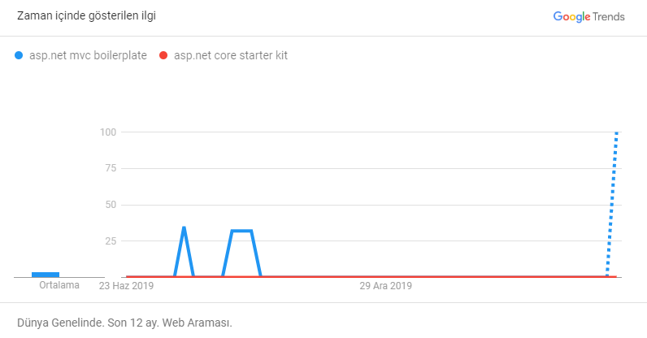
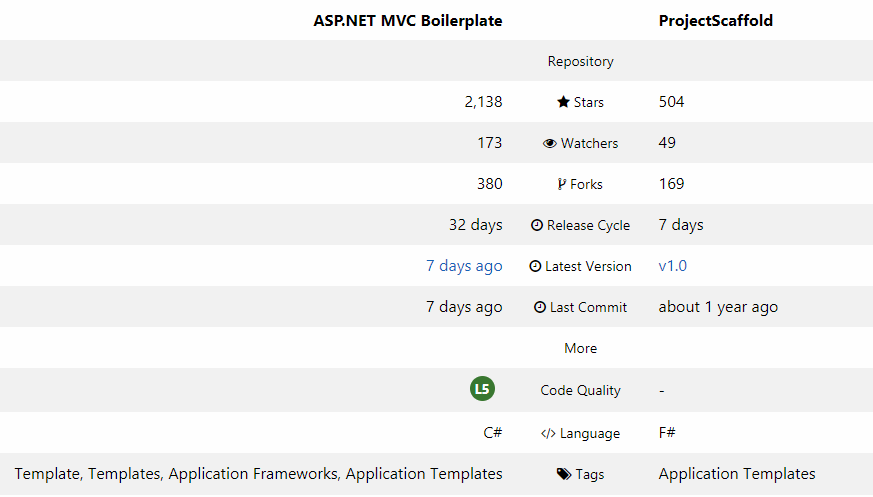
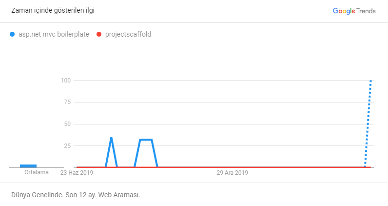
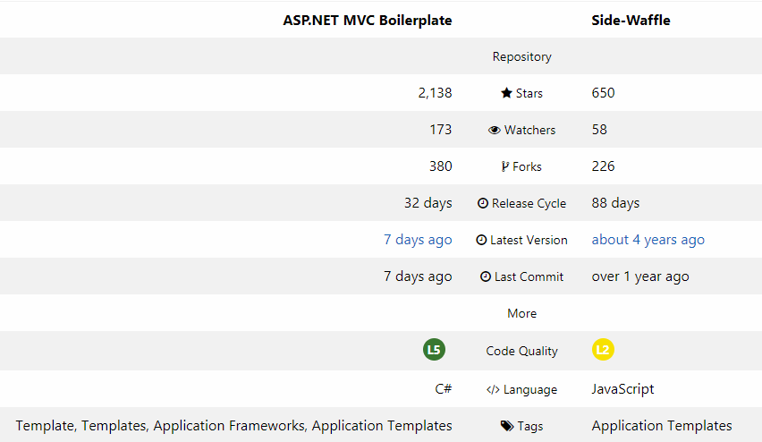
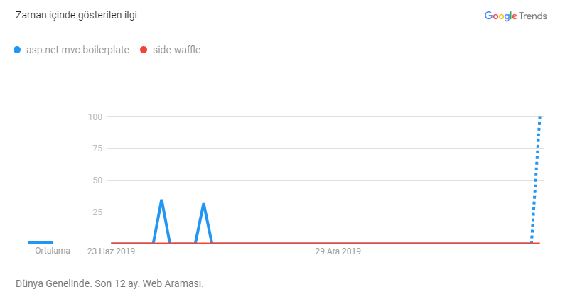
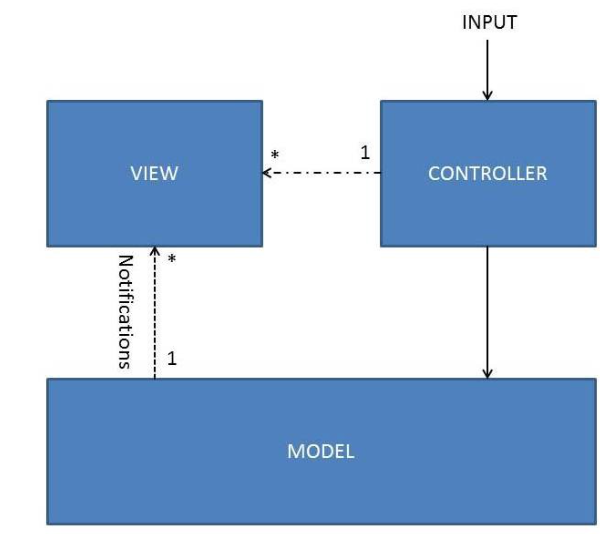
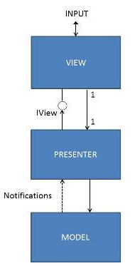
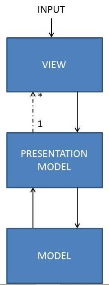
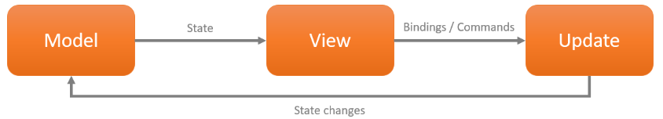

= ARAŞTIRMALAR

== GITHUB VS GİTFLOW, BITBUCKET

Geliştirme ilkelerimizden biri, yaptığımız her şeyin tekrarlanabilir ve incelenebilir olması gerektiğidir.Bunu başarmak için kullandığımız araç Git sürüm kontrol sistemidir . Git tekrarlanabilirlik ve gözden geçirilebilirlik sağlar, ancak yine de kullanıcının iş akışının nasıl göründüğünü belirlemesine izin verir.

=== Git Flow: Sürüm Kontrolüne Kapsamlı Bir Yaklaşım
Bilinen bir iş akışı yöntemine Vincent Driessen tarafından tarif edildiği gibi Git Flow denir . Git Flow, özellik dalları, sürüm dalları, ana hat veya geliştirme dalları ve düzeltmelerin nasıl ilişkili olduğunu açıklar. Bu yaklaşım, kullanıcılar tarafından kütüphaneler ve masaüstü uygulamaları gibi indirilen paket yazılımlar için çok iyi çalışır.

Ancak birçok web sitesi için Git Flow aşırıya kaçmıştır. Bazen, ana hat geliştirme ve serbest bırakma dalları arasında, ayrımı değerli kılmak için yeterince büyük bir fark yoktur. Alternatif olarak, düzeltmeler ve özellik dalları için iş akışınız aynı olabilir.

=== GitHub Flow: Basitleştirilmiş Bir Alternatif

Git Flow'un doğasında bulunan ek karmaşıklığın aşağıdaki gibi belirli durumlarda gerekli olduğunu bulduk:

* Ayrılmış olarak adlandırılmış veya numaralandırılmış sürümleriniz olduğunda
* Bir sonraki sürüm için özellikleri geliştirmeye ve entegre etmeye devam ederken, bir sürüm adayı üzerinde geliştirmeyi dondurmanız gerektiğinde. Bu, örneğin bir sürüm adayının gözden geçirilmesi, hata düzeltmeleri ile kabul edilmesi veya yayınlanmadan önce onaylanması gerektiğinde olabilir. Geliştirme, bir sonraki sürümde aynı anda devam eder
* Yazılımın birden fazla sürümünün bağımsız olarak desteklenmesi ve bakımının yapılması gerektiğinde

Bu senaryolardan herhangi biri geçerliyse Git Flow'dan yararlanabilirsiniz. Yoksa, GitHub Flow tarafından daha iyi hizmet edilebilir.

==== Sonuç olarak
GitHub Flow'u birçok projemiz için kullanıyoruz. Git Flow'un neredeyse tüm işlevlerini sağlar, ancak daha az ek yük ile daha uyumlu bir iş akışı için geri ölçeklendirilir.

Daha karmaşık web uygulamalarımızdan bazıları daha karmaşık bir iş akışı gerektirir. Bu projeler için Git Flow'u kullanıyoruz.

=== GitLab 

GitLab, GitHub’ın kullanıcılara sağladığı işlevlerin tamamını sunan bir Git servisidir.Açık kaynak(open source) projelerinizi bu servis üzerinde ücretsiz bir şekilde oluşturabilir ve yönetebilirsiniz. GitLab daha çok firmalarda tercih ediliyor çünkü : Ücretsiz sürümünde kendi sunucularınıza kurarak sadece kurum içi kullanıcıların erişebileceği GitLab servisi hizmeti bulunmaktadır.

=== Bitbucket

Bitbucket kurulduğunda sadece projelere Mercurial için depolama desteği verdi. Atlassian firmasının satın alınması ile birlikte 3 Ekim 2011 tarihinde Git desteği duyrulmuştur.Mercurial, yazılım geliştiricileri için platformdan bağımsız bir şekilde kullanılan bir sürüm(version) denetim aracıdır. 

* Git veya Mercurial gibi VCS(Version Control System) kullanan projeler için bir web depolama servisidir.
* Hem ticari planlarla hem de ücretsiz hesaplarla kullanılabilmektedir ve ücretsiz hesaplara en fazla beş kullanıyıca kadar limitsiz özel depo (repository) alanı sunmaktadır. Bundan dolayı genelde şirketlerde Bitbucket tercih ediliyor. Takım çalışması için ideal olan bu sistemi denemenizi tavsiye ederim.
* Pyhton dilinin bir framework’u olan olan Django ile yazılmıştır.

=== Github VS Bitbucket

. Fiyatlandırma : Bitbucket Github’a oranla daha ucuzdur. Bitbucket ücretlendirme konusunda GitHub’ın önündedir. 5 kullanıcıya(user) kadar, sınırsız private repository(özel depo) vermektedir. Ülkemizde fiyatlandırma göz önüne alınarak genelde şirketlerde Bitbucket tercih edilmektedir.

.  Kullanıcı Sayıları : Kullanıcı tercihi açık ara Github öndedir. Tahmini 3 milyondan daha fazla kullanıcıya sahip olan Github’ı, 1 milyonu aşkın kullanıcısı olan Bitbucket takip etmektedir.

. Desteklenen Versiyon Kontrol Sistemi(VCS): 

* Bitbucket ise hem Git’i hem de Mercurial’i desteklemektedir.
* Github sadece Git’i desteklemektedir.
. Doğrulama (Authentication): Bitbucket hesabınız olmadan da diğer platformlara ait hesaplarınızla giriş yapabilirsiniz. Github üyeliğiniz varsa ise o hesap ile de Bitbucket’a giriş yapabilirsiniz. GitHub ise Bitbucket’ın aksine bu yöntemi kullanılmamayı tercih ediyor.

==== Sonuç:

* Projelerinizin daha fazla bir kitleye ulaşmak istiyorsanız ve open source projeleri katkı sağlamak istiyorsanız Github kullanmalısınız.
* Benim projelerim bana özeldir ve kimseyle paylaşmak istemem, Mercurial kullanmak istiyorum ve hesabıma istediğim platformdan giriş yapmak istiyorum diyorsanız Bitbucket kullanmalısınız.

== GITHUB'DAKİ 3 MERGE METODU

Temiz bir git geçmişi tutmak, dev çabaları bozan bir hata veya sorunla ilgili taahhütleri izlemeye çalışırken çok zaman kazandırabilir. GitHub, birleştirme işlemlerinde birleştirirken üç seçenek sunar; bu üç seçenek şunlardır:

* Create a Merge Commit
* Squash and Merge
* Rebase and Merge 

Ana düşünce Git geçmişini temiz tutmak ve geleceğin kod yapısının neden böyle olduğunu anlamak için tarih boyunca taranan diğer geliştiriciler için temiz ve yararlı tutmak istediğimizde bu düşünce tarzını uygulayabiliriz.

=== Create a Merge Commit

Varsayılan seçenek olan github'da Merge Pull Request, tüm yorumları Pull Request'ten alır ve birleştirme işleminde yeni bir yorumları Mastar Branch'e ekler.

Örneğin, bir başlangıç yorumu ve 2 yeni yorum içeren bir Mastar Branch var, yeni yorumlar One ve Two.

image::1.png[]

Yeni bir özellik üzerinde çalışmak için master branch'den ayrılacağız ve Feature-Branch adlı yeni bir branch oluşturacağız. Biraz iş yaptıktan sonra, master ile merge etmek istediğimiz Three ve Four adında ek 2 tane daha yorumumuz olacak.

image::2.png[]

Merge pull request kullanıldığında, (daha önce master ile hiçbir şeyin birleştirilmediği varsayılarak) 3 ve 4 numaralı yorumlar master branch birleştirme olarak eklenecek ve birleştirme şubesi feature-branch olarak adlandıracağız. Bu yeni HEAD olacak.

image::3.png[]

Commit Merge branch feature-branch geçmişi taahhüt gibi görünecek Merge branch feature-branch. İletinin sağladığı köprü, 3 ve 4 ile orijinal PR'a geri dönmenizi sağlar.

Bu, PR'da ana dalda birleştirilirken, özellik dalını birleştirdiğimizde tam olarak neyin değiştiğini anlamak için git kesin mesajlarını geçerken ortaya çıkan git mesajı çok yararlı değildir. Rietta'da, eter squash birleştirmesi veya yeniden basma çekme istekleri lehine varsayılan "Birleştirme çekme isteği" ni devre dışı bıraktık. Bunu depo ayarlarınızda da değiştirebilirsiniz.

=== Squash and Merge

Squashing, bir şubeye yeniden basmak gibi çalışır, 5 taahhütlü çekme talebi alabilir ve tek bir taahhütte ezebilirsiniz. Bu, Birleştirme çekme isteğine benzer görünebilir, ancak kurnazca farklıdır.

Öncekiyle aynı senaryoyu almak:

image::4.png[]

Daha önce de belirtildiği gibi Merge pull request, basitçe özellik-şube taahhütlerini ekleme işlemidir ve özellik-şube taahhütlerinin 52906c3 Merge branch feature-branchher ikisiyle de PR'ye bir referans olarak kullanmaktadır. Bunun yerine kaydedilmesini ekleme 3ve 4birlikte taahhüt Merge branch feature-branch, biz birleştiriyoruz 3ve 4ve kombine sonuçta oluşan taahhüt 3(squashed)(Ben açıkça adlandırılmış 3(squashed), sen gibi her ne adlandırabilirsiniz!).

Github kullanıcı arayüzündeki squash seçeneği, varsayılan taahhüt mesajını değiştirmenize izin verecektir.

=== Rebase and Merge
Squash birleştirme yararlı olsa da, belirli kod değişiklikleriyle küçük bir işlemle uğraşırken Birleştirme çekme isteği kullanılmadan veya ezilerek birleştirilebilen düzeltmeler veya bir defalık taahhütler ne olacak?

Rebase, Git geçmişini düzeltmeler için temiz tutmanın veya bir defalık taahhütlerin bir yolu olarak parlıyor. Aynı senaryoya bakabilir ve yeniden birleştirme işleminin birleştirme işlemini basit ve Git geçmişini nasıl temiz tutabildiğini görebiliriz.

Özellik dalının üssü üstadır ve 3. ve 4. taahhütleri tanıtıyoruz. Yeniden inşası özellik dalımızı alır ve taahhütlerini ana dalın üstüne nakleder. Ana dalın HEAD'ini 3 ve 4 numaralı taahhütler olarak değiştiriyoruz, Birleştirme çekme isteği kullanarak gördüğümüz gibi 3 ve 4 numaralı komiteleri ekleyecek bir Birleştirme dalı özellik dalı yok.

image::5.png[]

== SONUÇ

Kod denetçimize değişikliklerde gezinme konusunda yardımcı olmak için Git'imizi PR'larda temiz tutmanın birçok yolu vardır.

On binlerce taahhüt içeren bir projeyi sürdürürken aynı zihniyet uygulanabilir. Örneğin, resmi Ruby on Rails deposunu alın! 73.000'den fazla taahhütleri vardır ve günlük olarak hızla geliştirilmeye devam etmektedir. Temiz bir Git geçmişine sahip olmak, zamandan tasarruf etmenize yardımcı olabilir ve Git geçmişinizi açarak güvenlik / uygulama kırıcı değişiklikleri izlemenin bir aracı olma avantajına sahip olabilir.

Burada Rietta'da, sadece dahili nedenlerle değil, aynı zamanda kod havuzlarımızın gelecekteki potansiyel sahipleri için iyi yönetilen git geçmişlerini saklamayı seviyoruz. Bu şekilde, potansiyel geleceğin koruyucularına yardımcı olurken müşterilerimize en iyi hizmeti sunabiliriz. Yukarıda belirtildiği gibi, "Bir Birleştirme Taahhüdü Oluştur" u özellikle kapatırız ve yalnızca "Yeniden Oluştur ve Birleştir" ve "Squash & Merge" kullanırız.

== ASP.NET Boilerplate

ASP.NET Boilerplate, “her şirket tek tek uğraşmasın, tüm .NET developer’lar için ortak bir framework geliştirelim” hedefiyle ortaya çıkmış açık kaynak kodlu, iyi dokümante edilmiş bir projedir. Sadece framework değil, modern uygulamalar için DDD(Domain Driven Design) tekniklerini baz alan sağlam bir mimari ve model sunar.
ASP.NET Boilerplate’in (ABP) sağladıkları: 
bakalım:

* Dependency Injection: Bu (base class’dan dolayı) bir application service olduğu için Transient olarak Dependency Injection sistemine otomatik olarak kaydedilmiştir. Kendisi için gereken tüm servisleri (bu örnekte sadece bir Repository) direkt olarak inject edebilir (constructor ya da property injection yapılabilir). ABP conventional, kolay kullanımlı ve hazır bir DI altyapısı sağlar.
* Repository: Her Entity için otomatik olarak bir repository oluşturulur. IRepository<Task> şeklinde Task repository’sini kullanıyoruz burada. IRepository’nin birçok hazır metodu var. FirstOrDefault bunlardan birisi.
* Authorization: Eğer bu servisi çağıran kullanıcının “task güncelleme” yetkisi yoksa daha metod çağrısı başlamadan uygun bir authorization exception fırlatır. Attribute kullanarak authorization kontrolünü basitleştirmiş oluyoruz.
* Validation: UpdateTaskInput DTO’su (Data Transfer Object) içerisinde Task Entity’siyle isim ve tip olarak birebir eşleşen property’ler var. Normalde ilk iş bunların validate edilmesi gerekiyor. ABP data annotation’lar ve custom validation teknikleri kullanarak gelen input’un property’lerini otomatik olarak validate eder, eğer valid değilse client’ın anlayacağı formatta bir Exception fırlatır (AJAX çağrısı için uygun bir JSON döner örneğin). Ayrıca nesnenin kendisinin null olmasına da izin vermez, böylece input == null mı kontrolüne gerek kalmaz.
* Audit Logging: Eğer audit logging açıksa bu metod çağrısını yapan kullanıcı, çağrının yapıldığı zaman, IP… gibi bilgilerle beraber çağrılan metod ve parametrelerini kaydeder. Ayrıca süre ölçümü de yapar, böylece yavaş metodlarımızı tespit edip kontrol edebiliriz.
* Unit Of Work: Her application service metodu bir unit of work kabul edilir. ABP, metoda girerken veritabanı bağlantısını otomatik olarak açıp bir transaction başlatır. Eğer metod hiçbir Exception fırlatmadan başarıyla tamamlandıysa transaction otomatik olarak commit edilerek bağlantı kapatılır. Böylece metod içerisinde farklı repository’leri dahi kullansak tüm işlemler atomic olmuş olur. Ayrıca Entity’lerde yapılan tüm değişiklikler eğer hata olmazsa metod bitiminde otomatik olarak kaydedilir. Bu nedenle repository.Update(task) gibi bir kod çağrısına dahi gerek kalmamış oluyor.Burada birçok ayrıntı ve konfigurasyon var ancak varsayılan davranış bu şekildedir.
* Exception Handling: Bir web uygulamasında, bu metod bir Exception fırlatırsa bu Exception otomatik olarak handle edilir, client’ın request türüne göre (AJAX ya da normal request) uygun bir dönüş değeri gönderilir client’a. Client tarafında da bu otomatik olarak handle edilerek kullanıcıya uygun hata mesajı gösterilir. UserFriendlyException özel bir exception türü olup direkt olarak mesaj kullanıcıya gösterilir. Diğer Exception’lar sadece loglanır ve kullanıcıya genel bir hata mesajı gösterilir.
* Logging: UpdateTask metodunun ilk satırında direkt olarak hazır Logger nesnesini kullanarak log yazabiliyoruz. Varsayılan loglama kütüphanesi olarak Log4Net kullanılır.
* Localization: Dikkat edilirse Exception fırlatılırken L adın bir metod kullanıldı. Bu da base class’dan gelen bir metod olup verilen key’e ve o anki kullanıcının diline göre ilgili lokalizasyon metnini verir.
* Auto Mapping: Son satırda ABP’nin MapTo extension metodunu görüyoruz. ABP, Automapper kullanarak bir nesneyi diğerine map edebilir. Böylece gelen input’daki (daha önce validate edilmiş) verilerle Entity’deki property’leri güvenle ezebiliyoruz.
* Dynamic Web API Layer: Bu application service aslında basit bir sınıftır. Browser’dan AJAX’la bunu çağırabilmek için genellikle wrapper şeklinde bir Web API Controller geliştirilir. ABP bu controller’ı runtime’da otomatik yaratır, böylece client’dan doğrudan application service’ler kullanılabilir olur.
* Javascript AJAX Proxy: Dinamik oluşturulan Web API’yi çağırmak için de ABP tarafından yine dinamik olarak bir javascript proxy’si oluşturulur. Böylece javascript’den metod çağırır gibi application service’leri kullanabiliriz.
Görüldüğü gibi çok basit gözüken bu işlem için dahi bütün bunları manuel yapmaya kalsak oldukça zamanımızı alacakken ABP framework tüm bunları otomatik yaparak bizi benzer ve rutin işlemleri tekrar tekrar yapma zahmetinden kurtarır.

Bütün bunların dışında aşağıdaki konularda da bize yardımcı olur:

* Modularity: ABP, modüler uygulama geliştirmek için bize güçlü bir altyapı sunar. Kendi paketleri de modül olarak geliştirilmiştir.
* Multi-Tenancy: ABP multi-tenancy destekler. Tek bir veritabanında aynı uygulamayı her müşteri kendi perspektifinden kullanır, birbirinin datasını görmez, kendi rol, kullanıcı ve yetkileri olur.
* Data Filters: Soft-delete gibi pattern’leri kolaylaştırmak için otomatik data filtreleme kullanır. En basit haliyle, eğer gerekiyorsa, Where şartına IsDeleted=False ifadesini otomatik ekler.
* Setting Management: Her uygulamada bazı ayarların kaydedilmesi ve okunması gerekir.
* Domain Events & EventBus: Global domain event’lar tanımlamak, tetiklemek ve yakalamak için altyapı sağlar.
* Unit & Integration Tests: ABP içinde unit ve integration test’leri kolaylaştırmak için gereken temel sınıflar mevcuttur.

=== Serene VS ASP.NET Boilerplate
image::6.png[]

image::7.png[]

image::8.png[]

=== ASP.NET Boilerplate VS Template's 10

image::9.png[]

image::10.png[]

image::11.png[]

=== ASP.NET MVC Boilerplate VS ASP.NET Core Starter Kit
image::12.png[]

image::13.png[]

=== ASP.NET MVC Boilerplate VS ProjectScaffold

=== ASP.NET MVC Boilerplate and Side-Waffle

== RAZOR PAGE
ASP.NET Core 2.0 ile beraber hayatımıza giren Razor Pages, ASP.NET Core MVC alt yapısında, sayfa bazlı web uygulamaları geliştirebileceğimiz bir programlama modeli. Tamamen MVC alt yapısı üzerine geliştirilmiş bir kabuk olarak düşünebilirsiniz. MVC template’lerindeki klasör sayısını azaltmak, sayfa bazlı uygulamaları daha kolay geliştirmek için tasarlanmış yeni bir model. Altını çizerek belirtmek isterim ki, MVC’ye alternatif ya da onun yerini alacak bir model değil.

PHP ya da eski ASP ile tecrübesi olanların ya da scripting dilleri ile uygulama geliştirenlerin daha çok hoşuna gideceğini düşünüyorum. Büyük bir ihtimal, web uygulaması geliştirmeyi daha basite indirgemek ve script tabanlı dilleri tercih edenleri de mutlu etmek için böyle bir modele yönelmiş olabilir Microsoft. Ama asıl önemlisi web uygulaması yapmayı yeni öğrenmek isteyen kişileri çekmek sanırım Razor Pages’ın en büyük amacı.Çünkü gerçekten kolay.

MVC alt yapısını kullanarak yapıldığı için uzun zamandır MVC modeli ile geliştirme yapanlar için çok fazla bir şey ifade etmeyecektir. Hatta bir çok MVC tercih eden kişi, ne gerek vardı falan da diyor. Kendilerince haklılar. Burda tekrar belirtmek isterim ki, Razor Pages, MVC’nin bazı özelliklerini daha basit ve kolay hale getiriyor. Uzaya roket gönderebileceğiniz bir teknoloji değil…

Razor Pages, adından da anlaşılacağı üzere “Razor” ve “Sayfa” konsepti üzerine geliştirilmiş bir model. MVC’deki View kavramı, biraz daha geleneksel tabirle “sayfa” olarak karşımıza çıkıyor. Ama tabii ki Layouts, TagHelpers gibi yaklaşımlar Razor Pages’de de var.

Razor Pages’de sayfalar birer PageModel ile tanımlanıyor. PageModel’leri MVC’deki Controller ve Model olarak düşünebilirsiniz. Web sayfanıza gelen talepler(request), Controller’daki gibi PageModel tarafından karşılanıyor. Controller’a ek olarak View tarafına taşınan model de bu PageModel üzerinde olabilmekte.

== C# Json Serialize / Deserialize

Serialization: Bir nesnenin saklanacak / transfer edilecek forma dönüştürülme işlemidir. Serileşmenin tersi olarak Deserialization ifadesi kullanılır ve bu da Stream'in (Akış) nesne modeline dönüştürülme işlemidir.

 .Net Framework içerisinde bulunan System.Runtime.Serialization namespace'i bu işlemler için kullanılmaktadır. İçerisinde bulunan sınıflar ve araçlar sayesinde, kendi nesnelerimizi istenilen/ihtiyaç duyulan formatta saklama imkanı sunar.

Serialization bize iki temel metot sunar;

XML "eXtensiple Markup Language" ve SOAP "Simple Object Access Protokol" Serileştirme işlemleri
Binary (ikili) Serialization
Binar Serialization: Tür bağımlılığı açısından önemlidir. İkili serileştirme işlemi, daha çok bir birinden bağımsız iki uygulama arasında, nesne modellerini taşımak için kullanılır. İkili serileştirme işlemi; bir nesnenin durumunun saklama ortamına uygun hale getirilip yazılması süreci olarak tanımlanabilir. İşlem süresince, nesnenin “public” ve “private” öğeleri, sınıfın adı, sınıfı barındıran Assembly’ nin adı saklama ortamına yazılmak üzere “byte” lar akışına çevirilir.
Nesne, Deserialize edildiğinde ise nesnenin tam bir kopyası oluşturulur ve kullanıma sunulur. Binary serialization ile .Net Remoting kullanarak farklı domain içinde bulunan bir bilgisayardaki uygulamalara bile taşınabilir. Bazen Binary Serialization ile bir nesneyi serialize etmek, sürücüde gereğinden çok fazla yer işgal etmeye neden olabilir, çünkü nesnemiz kendi ve içinde bulunan her yapı ve nesne için sürücüde binary header ile fazladan yer işgal eder. Hatta eğer nesnelerden oluşmuş bir array veya collection(IList, ObservableCollection vb…) varsa bunun içinde bulunan her nesne içinde (foreach) bir binary header (o class’ın yapısı) dosyamıza eklenerek dosyanın boyutunu şişirebilir.

XML ve SOAP Serileştirme: Tür esnekliği ile ön plana çıkan bu yapı, çok sık tercih edilmektedir. XML Serileştirme işleminde sadece ortak tipler ve metotlar serileştirilebilir. Bu yapıda verilerimnizi kullanacak olan uygulamayı kısıtlamadan saklayabiliriz. XML ve SOAP açık bir standart yapı olduğundan, aynı zaman da her türlü uygulama ile rahatlıkla okunabildiğinden veri paylaşımı oldukça hızlıdır.

== MVC vs MVP vs MVVM
MVC (Model-View-Controller), MVP (Model-View-Presenter) ve MVVM (Model-View-View Model) patternlerinin oluşmasının arkasında yatan temel motivasyon aslında az öncede bahsettiğim gibi hem Separation of Concerns prensibini uygulamak hemde kolay bir şekilde Unit Test yazılmasına olanak sağlamak, yani Test Driven Development (TTD) yöntemini uygulayabilmek. Bazı durumlarda da reusibility’i arttırabiliyor tabi, çünkü bu patternleri uyguladığımız zaman ufak değişiklerle, alt yapımızı koruyarak uygulamımın farklı platformlarda (Windows Forms, Asp.NET, WPF …) çalışmasını sağlayabiliyoruz yani UI bağımsız uygulamalar geliştirebiliyoruz. 

=== MVC (Model-View-Controller)
Aslında en eski pattern MVC. Kökü 1970'lere kadar uzanmakta. 

Controller kullanıcıdan gelen inputları karşılar, ayrıca UI ile ilgili bütün akışı yönetir ve kararları verir. Controller View hakkında hiç birşey bilmez ama View Controller’ı bilir. Görüldüğü üzere Controller ile View arasında 1-n bir ilişki var yani bir Controller birden fazla View tarafından kullanılabilir. Controller kullanıcıdan gelen inputlar doğrultusunda Model üzerinde değişikleri yapar, Model değiştiğini View’e notify eder yani View ile Model arasında Observer ilişkisi var. View, Model’e register olur, görüldüğü üzere bir model’e birden fazla View register olabilir. Aralarında ki observer ilişkisi sayesinde, Model’deki herangi bir değişiklik ona register olmuş bütün View’lere yansır.

MVC’nin en büyük avantajı sorumlulukları Model,View ve Controller’a temiz bir şekilde dağıtmasıdır. Controller’lar uygulamanın akışını kontrol ederler, nerede neyin nasıl yapılmasına gerektiğine karar verirler. View sadece kendisinin nasıl update olacağına ilişkin business’ı içerir, Model’i oluşturur ve kullanıcıya gösterir. View uygulamayla ilgili hiç bir logic içermediğinden dolayı farklı platformlar (Windows, Web) için aynı controller’ı kullanan birden fazla View olabilir.

Ama dezavantajlarıda yok değil. View ile Model arasındaki observer ilişkisi ilk bakışta karışık gelebilir, View’in güncellenmesi için, Controller’ın Model’i güncellemesi gerek ki Model’de değiştiğini View’e bildirebilsin. Ayrıca .Net gibi modern programlama ortamları User Inputlar’ın eventlerini zaten kendileri handle ediyorlar, mesela buton’a tıklandığıda veya textbox’ın text’i değiştiğindeki eventler gibi. Bu durumlarda klasik MVC’yi uygulamak zorlaşıyor, inputları direk Controller karşılasın diye zaten UI’ın kendi handle ettiği o doğal yapıyı kırmak durumunda kalınabiliyor. Dediğim gibi MVC’nin son 30 yılda birçok farklı implementasyonu çıkmış durumda, bazı durumlarda Controller View’i bir interface aracılığıyla biliyor, bazı değişiklikler View üzerinde eventler aracılığıyla kendisi yapabiliyor vs.
Ayrıca klasik anlamda MVC uygulandığında Unit Test yaparken zorlanabiliyoruz, View’in update olmasıyla ilgi süreç oldukça dolaylı bir şekilde yapılıyor, Controller ile View arasında bir abstraction ile bile olsa ilişki yok, View’leri Mock’layamıyoruz.

=== MVP (Model-View-Presenter)
MVP Pattern’i aslında MVC’den evrilmiş bir pattern, sadece bağımlılıklar değişiyor ve Controller’ın yerine Prenseter (ki bu durumda kendisine hala Controller denebiliyor) geliyor.

Görüldüğü üzere burada inputları direk View karşılıyor, modern programlama ortamlarının mantığına daha uygun. View Presenter’ını biliyor, Presenter ise View’i bir interface aracılığıyla biliyor aralarında bir abstraction var. Ayrıca MVC’nin aksine View ile Presenter arasında 1–1 ilişki var. Presenter Model’i manipule ediyor, Model’in değişikleri Presenter’a notify etme durumu birazcık tartışmalı, etmeyedebilir, Presenter ilgili değişikliği yapıp, View’i kendisi güncelleyebilir. Zaten buradaki en büyük fark MVC’nin aksine Presenter’ın View’i bir interface aracılığıyla kendisinin güncellemesi, View burada Presenter’a interface aracılığıyla istediği bilgiyi açabilir, ister Textbox’ın Text’i olsun ister Buton’ın Enabled’ı olsun. Presenter View’in nasıl bir View, Web mi? Windows mu? olduğuyla ilgilenmiyor, sadece data akışıyla ilgili ne yapması gerektiğini, View’den gelen etkileşimleri nasıl karşılaması gerektiğini ve View’de nasıl değişikler yapması gerektğini biliyor. Yani Prensenter’ımız burada karar mekanizaması rölünü üstleniyor.

MVP ile hem Windows Forms hem ASP.NET Web Forms uygulamalarını çok rahat geliştirebilir.

=== MVVM (Model-View-ViewModel)
MVVM Pattern’i hakkında bilgi vermeden önce Presentation Model hakkında bilgi vermek istiyorum. Çünkü MVVM dediğimiz şeye; WPF ve Silverlight için Prensentation Model diyebiliriz.

Şema birazcık MVP’yi andırıyor fakat buradaki fark, Presentation Model hem View ile ilgili stateleri tutuyor hemde View hakkında hiç birşey bilmiyor. Aslında PM View’in state ve davranışlarıyla ilgili bilgiyi kendi üzerine alıyor ve Business Layer ile arasındaki kordinasyonu sağlıyor ve View’e karar vermeyle ilgili çok az şey bırakıyor. View yine stateleri tutuyor aslında. Fakat MVP’nin aksine Presentation Model View ile ilgili hiç bir bilgiye ihtiyaç duymuyor, bu yüzden ki View ile PM arasında 1-n bir ilişki var, bir PM birden fazla View’de kullanılabiliyor, bu kısmıyla MVC’ye benziyor, fakat MVC’nin aksine View üzerinde ki manipulasyonlar PM üzerinden gerçekleşiyor. Aslında şöylede bakabiliriz, PM ile View arasında yine bir observer ilişkisi var, .Net’e kullanım şekillerinden biride INotifyPropertyChanged interface’inden türeyip, .Net’in binding alt yapısını kullanması. Zaten özünde yaptığı iş DataBinding. Kendi propertylerini View’in propertyleriyle senkronize ediyor, aynı zamanda state’lerede karar veriyor, mesela şu şu TextBox dolduğunda şu Buton enabled olsun gibi. Tabi herzaman enabled olucak bir kontrol’un state’ini PM’de tutmak anlamsız.

PM’in en büyük avantajı, hiç bir View’e ihtiyaç duymadan bir View’in davranışlarını ve Data’sını barındarabilmesi, bu yapısıyla TDD’ye (Test Driven Development) çok uygun.

=== MVU

MVU kendisini farklı teknoloji yığınlarında giderek daha fazla kabul görürken, kökenleri fonksiyonel programlama dili Elm topluluğuna sahiptir:

Karaağaç Mimarisi, webapps ve oyunlar gibi etkileşimli programları tasarlamak için bir modeldir. Bu mimari Elm'de doğal olarak ortaya çıkıyor gibi görünüyor. İlk Elm programcıları, icat eden birinden ziyade, kodlarında aynı temel kalıpları keşfetmeye devam ettiler. Önceden planlama yapmadan iyi tasarlanmış bir kodla biten insanları görmek biraz ürkütücü!

Ama yeterli tarih, bu yazı bunun yerine mevcut favori programlama dillerimden birine dayanan hızlı bir girişe odaklanıyor F#. Temel temelleri kendi bakış açımdan ve mevcut anlayışımı açıklamaya çalışıyorum. Eminim, okuduktan sonra daha fazla soru ile karşılaşırsınız, örneğin, nasıl ölçeklendirilir.
